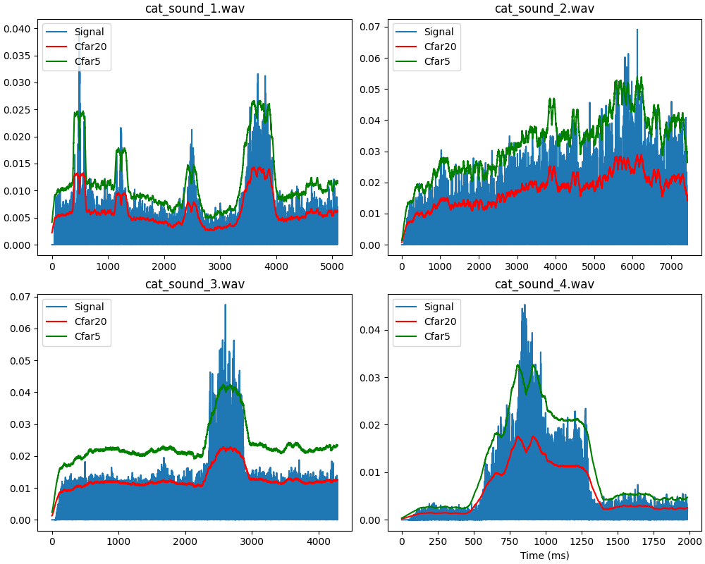

# SignalProcessingPlayground

Experimenting with python and signal processing

## Constant False Alarm Rate (CFAR)

CFAR is a method use for identifying radar signal returns from noise and clutter. This simple implementation of CFAR, referred to as Cell Averaging CFAR (CA-CFAR), works by averaging the leading and lagging signals around the Cell Under Test (CUT) to form a noise estimate.  This noise estimate, also referred to as the detection threshold, allows for the identification of radar detections, which appear as the peaks that exceed the threshold.

This CFAR algorithm uses a sliding window centered around the CUT. Adjacent to the CUT are leading and lagging guard cells used to prevent peaks from leaking into the training cell.  Immediately adjacent to the guard cells are the leading and lagging training cells.  The training cells are the cells that will be used for the formation of the noise estimate. The number of training and guard cells can be modified to tailor the algorithm's performance based on the system and environment in question.  After calculating the average of the leading training cells and the average of the lagging training cells, the greatest of the leading or lagging training cells is adjusted by a threshold factor (calculated from the specified false alarm rate) and recorded as a point in the noise estimate. 

Below are the results of running this CFAR algorithm on 4 different audio samples produced by my cat.  The samples were processed with a probability of false alarm of 20% (red) and 5% (green).  As you can see, a false alarm rate of 20% has not done a good job of allowing us to identify peaks in the signal, whereas the false alarm rate of 5% has performed much better, though still far from perfect. 

